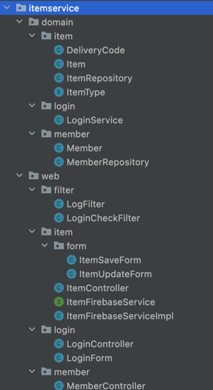
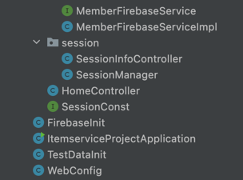

# ItemService-project

---
## 목차

- 개발 기간
- 개발 목적
- 개발 환경
- 사용 기술
  + 백엔드
  + 프론트엔드
- 주요 사항
- 패키징 구조
- 실행 화면
- 시스템 아키텍쳐
- 다이어그램
- 핵심 기능
  + 로그인
  + CRUD
  + 타임아웃
  + 아이템 상세 정보
  + 아이템 정보 수정
- 보완할 점

---

## 개발 기간
- 22.03.20 ~

---

## 개발 목적
- 현재 동영상 강의와 검색을 통해 스프링 부트의 기능과 다른 것들을 배우고 있는 중에 있습니다. 하지만 가만히 보고 있는 것보다 직접 제가 손으로 작성하여 웹 사이트를 만들어보고 싶었습니다. 그리고 제가 배운 기술들을 적용해 보아서 실제 웹 사이트처럼 기능하고, 보여질 수 있게 하고싶습니다.
---

## 개발 환경
- IntelliJ
- Postman
- Github
- Firebase

---

## 사용 기술

### 주요 프레임워크/라이브러리

### 백엔드
+ Java 11 openjdk
 + 스프링 부트 2.6.0
 + Thymeleaf
 + Lombok

#### Database
  * Firebase

#### 프론트엔드
  + Javascript
  + HTML/CSS
  + Bootstrap
---

## 주요 사항

* 개인으로 스프링 부트를 사용하여 웹 애플리케이션 전과정 개발, 경험, 운영

* MVC 프레임워크 기반 백엔드 서버 구축,

* 로그인 필터, 타임아웃

* 파이어베이스 연동,

---
## 패키징 구조

---

## 실행 화면

---

## 시스템 아키텍처

---

## 다이어그램

---

## 보완점

---
